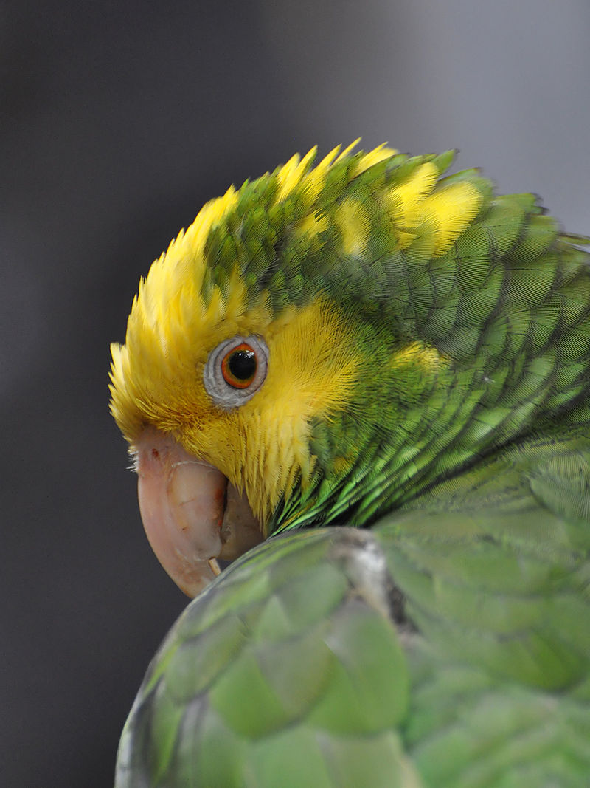

# Photodedupe
Photodedupe is a command line utility for identifying duplicate photos irrespective of image resolution, compression settings or file format. It compares the photo content visually and does not rely on metadata to perform the de-duplication. Each set of duplicates is sorted by resolution to determine the best copy of each photo found. Photodedupe is multithreaded and can handle large sets of images.

In the example below the image on the right has been exported with a higher JPEG compression level than the image on the left. The two photos may appear visually identical but only about 18% of the pixels are actually the same, therefore traditional hash based file de-duplication methods will not work. Photodedupe can identify both of these images as identical duplicates.



## Downloads / Builds

Builds of photodedupe for x86 Linux and Raspberry Pi are available for download from the [releases page](https://github.com/InexplicableMagic/photodedupe/releases/tag/v0.2.0).

## Usage

One or more directories can be supplied on the command line and photodedupe will recursively inspect them for images.

```
photodedupe dir_of_images/
```

A list of files can be supplied as arguments:

```
photodedupe image1.jpg image2.jpg image3.jpg
```

Or a list of file paths can be piped in:

```
find photos/ -name '*.jpg' | photodedupe
```

By default photodedupe will only inspect files with common image file extensions. JPEG, PNG, TIFF and GIF images are supported. However image file formats can also be auto-detected. To inspect every file regardless of extension (or lack of extension) and determine if each may be an image, use the ```--any-file``` option. The extension check also applies to when lists of files are piped in on stdin.

The default output only lists images that have duplicates. The highest resolution version will be listed first as the "best" copy, followed by any lower resolution versions listed as duplicates. If there are no duplicates there will be no output on stdout.

```
Best(512x341): unit_test_images/cat2_best.jpg
	Duplicate(510x340): unit_test_images/cat2_duplicate_1.jpg
	Duplicate(100x67): unit_test_images/cat2_duplicate_2.png
```

To list every image file found regardless of whether it has a duplicate use the ```--all``` option.

To list only the highest resolution version of each image use the ```--uniques``` option. This option could be used to copy the highest resolution versions to a different directory e.g:

```photodedupe --uniques dir_of_photos/ | xargs -i cp "{}" best_copies_only_dir/```

To list only the lower resolution duplicate images, use the ```--duplicates``` option. This option could be used to remove duplicates from a directory e.g:

```photodedupe --duplicates dir_of_photos/ | xargs -i mv "{}" duplicate_photos_dir/```

Note that photodedupe is performing a fuzzy match and is not 100% accurate. It is not advised to delete duplicates without manual inspection.

## Performance

Photodedupe uses four threads by default to process images. The number of threads can be increased using the ``--threads`` option. More than the specified number of threads may actually be used due to further multithreading within the underlying libraries.

Up to 20,000 images all photos found are compared to all others. However after this number of images, the performance of this approach starts to become intractable. Photodedupe will then switch to a different algorithm that is less capable of detecting duplicates but can handle much larger numbers of images. A warning will be printed to stderr to explain when this occurs. It is possible to force use of the all to all comparison variation using the ```--force-colour-diff-only``` flag. However this is not advised for large image sets as the performance will decline significantly. 

Photodedupe is not as accurate on vector art or images containing little variance such as very dark photos. Images are tested for variance, where variance is below the threshold where de-duplication is likely to be reliable the images are identified as unique to prevent false positives.

Photodedupe does not detect transformations of images as duplicates. If the image has been significantly rotated or cropped it will be identified as unique.

The internal threshold at which a duplicate is detected can be be tuned using the ```--colour-diff-threshold``` option which accepts an integer between 0 and 49000. The default threshold is 256. Setting this value closer to zero will cause fewer duplicates to be found. At values close to 49000 virtually all images will be declared duplicates.
