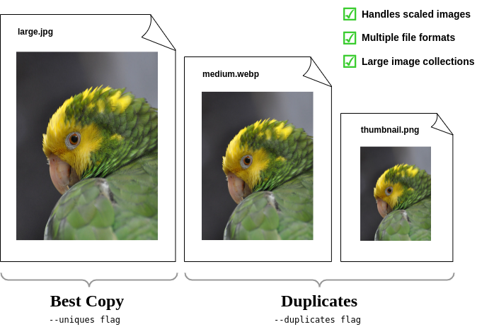

# Photodedupe
**Photodedupe** is a command line utility for identifying duplicate photos regardless of whether the images have been scaled or have differing file formats. It compares the image content visually and does not rely on metadata or file hashes to perform the de-duplication. 

Where duplicates are identified, the images are sorted by resolution such that the largest version of each image appears first. It is possible to list only the highest resolution versions of all images, or alternatively to list only the duplicates (lower resolution versions). This allows the best quality images to be extracted from a photo collection or the duplicates removed. Sorting in this way is helpful for applications such as removing thumbnails from image collections or separating scaled web resolution images from the original high resolution version.

The output is a list of file paths that can be piped to other commands such that the required images can be organised into folders (example usage below). Photodedupe can work with large image collections of hundreds of thousands or millions of images and scales to any number of CPU cores.

<p align="center"></p>

## Downloads / Builds

Builds of photodedupe for x86 Linux, Windows and Raspberry Pi are available for download from the [releases page](https://github.com/InexplicableMagic/photodedupe/releases/).

## Usage

One or more directories can be supplied on the command line and photodedupe will recursively inspect all of them for images:

```
photodedupe dir_of_images_1/ dir_of_images_2/ dir_of_images_3/
```

A list of specific image files can be supplied as arguments:

```
photodedupe image1.jpg image2.jpg image3.jpg
```

Or a list of file paths can be piped in. This method can be used to select only images of a certain format by file extension:

```
find dir_of_photos/ -name '*.jpg' | photodedupe
```

By default photodedupe will only inspect files with common image filename extensions. JPEG, PNG, TIFF, GIF and WebP images are supported. The extension check also applies when lists of files are piped in on stdin. However, if your images do not have appropriate filename extensions, image file formats can also be auto-detected. To inspect every file regardless of extension (or lack of extension) and determine if each may be an image, use the ```--any-file``` option.

The default output only lists images that have duplicates. The highest resolution version will be listed first as the "best" copy, followed by any lower resolution versions listed as duplicates. If there are no duplicates there will be no output on stdout.

```
Best(512x341): unit_test_images/cat2_best.jpg
	Duplicate(510x340): unit_test_images/cat2_duplicate_1.jpg
	Duplicate(100x67): unit_test_images/cat2_duplicate_2.png
```

To list every image file found regardless of whether it has a duplicate use the ```--all``` option.

To list only the highest resolution version of each image use the ```--uniques``` option. The output will include images that do not have any duplicates. This option could be used to copy the highest resolution version of each image to a different directory. 

In the below example photodedupe outputs a list of filenames of the best versions of each image on stdout. The xargs command reads each filename, substitues it for the two braces and executes the provided command. This then causes each listed file to be copied to the specified directory.

```photodedupe --uniques dir_of_photos/ | xargs -i cp "{}" unique_best_versions_dir/```


To list only the lower resolution duplicate images, use the ```--duplicates``` option. This option could be used to remove duplicates from a directory e.g:

```photodedupe --duplicates dir_of_photos/ | xargs -i mv "{}" duplicate_photos_dir/```

Note that photodedupe is performing a fuzzy match and is not 100% accurate. It is not advised to delete duplicates without manual inspection.

Photos below a user specified resolution can be ignored. In the following example photos will not be inspected that have either a width of less than 150 pixels or a height of less than 100 pixels. This option can be helpful if e.g. a web page of high resolution photos has been downloaded but the directory also includes a variety of other images present on the page that are not required such as navigation button images etc. The button images will tend to be lower resolution than the required photos and so they can be immediately filtered out with this option.

````photodedupe dir_of_photos/ --min-resolution 150x100````

## Comparing Image Directories

This feature enables a directory of new images to be compared against a pre-existing collection of photos to determine if any of the new images already appear in the collection. This can be used to update a photo collection with new unique images derived from a new source. An example application might be for use with a web scraper that periodically downloads all the images from a regularly updated web page. This option can be used to determine if any of the most recently downloaded images are new or if they were downloaded on a previous occasion.

To identify which of the new images already exist in your collection pass the directory of new images to be tested to the ``--compare`` option, then supply one or more paths to the pre-existing photo collection as arguments. 

Supply the ```--uniques``` flag to show which images in new_images_dir are unique with respect the existing collection. You might then move the new images found into your collection.

```photodedupe --uniques --compare new_images_dir/ collection_of_existing_images/```

Supply the ```--duplicates``` flag to show which images in the new_images_dir are duplicates of the existing collection. If photos in the new images directory already exist in the collection at the same or lower resolution, the new images will be reported as duplicates. If however a photo appears in the new images directory at a higher resolution than present in the collection, it will not be reported as a duplicate. This is to enable better quality versions of existing images to be discovered and added to the collection. This means you may be adding duplicates to the collection, but the duplicates added will be better quality versions of images than the versions you already have. If you do not want this behaviour and you would like duplicates to be reported in all circumstances, even if the new image is higher resolution, additionally supply the ```--ignore-resolution``` flag.

```photodedupe --duplicates --compare new_images_dir/ collection_of_existing_images/```

The new images directory passed to ```--compare``` is inspected recursively and sub-directories will also be inspected for images. The same rules apply as for other directories. By default only files with common image file name extensions (such as .jpg) will be inspected unless the ```--any-file``` option is used where all files will be inspected. 

It is also possible to specify a single specific image file to be compared against the entire existing photo collection. This can be used to effectively perform a database query to ask the question as to if you already have this specific image in your collection or not.

```photodedupe --duplicates --compare image.jpg collection_of_existing_images/```

When using ```--compare```, any duplicates present in the existing collection are not reported. Only duplicates present in the new images directory are reported. Reporting images found in the collection is just the default behaviour, in which case simply do not use the ```--compare``` option at all and pass the new images directory as a regular argument together with the existing photo collection.

To determine where specifically the images in the new images directory appear in the existing photo collection use the ```--compare``` option alone (without either the ```--duplicates``` or ```--uniques``` flag). This will show only instances where there is a duplicate of an image in the new images directory. Only the highest resolution version will be shown from the collection (unless the version in the new images directory is the best version).

### Example Behaviour of --compare

In the example below the directory "new_images" is passed to the ```--compare``` option and the ```--duplicates``` flag is used. The existing_collection directory is passed as an argument. All of the images in the below table are visually duplicates of each other:

|File|Resolution|Shown As Duplicate?|
|----|----------|------------------|
|new_images/image\_dupe\_1.jpg|5 MP|No|
|existing_collection/image\_dupe\_2.jpg|4 MP|No|
|new_images/image\_dupe\_3.jpg|3 MP|Yes|
|existing_collection/image\_dupe\_4.jpg|2 MP|No|
|existing_collection/image\_dupe\_5.jpg|1 MP|No|

Image\_dupe\_1 is not shown as a duplicate because at 5 megapixels it exceeds the resolution of the best copy in the existing collection (Image\_dupe\_2), which is only 4 MP. Image\_dupe\_3 is displayed as a duplicate because at 3MP it is below the resolution of the best copy in the existing collection. Image\_dupe\_4 and Image\_dupe\_5 are not shown because they are in the existing collection and not in the new images directory.


## Performance

Photodedupe uses four threads by default to process images. The number of threads can be increased using the ``--threads`` option. More than the specified number of threads may actually be used due to further multithreading within the underlying libraries.

Up to 50,000 images, all photos found are compared to all others. However after this number of images, the performance of this approach starts to become intractable. Photodedupe will then switch to a different algorithm that is less capable of detecting duplicates but can handle much larger numbers of images. A warning will be printed to stderr to explain when this occurs. It is possible to force use of the all to all comparison variation using the ```--force-colour-diff-only``` flag. However this is not advised for large image sets as the performance will decline significantly. 

Photodedupe is not as accurate on vector art or images containing little variance such as very dark photos. Images are tested for variance, where variance is below the threshold where de-duplication is likely to be reliable the images are identified as unique to prevent false positives.

Photodedupe does not detect transformations of images as duplicates. If the image has been significantly rotated or cropped it will be identified as unique.

The internal threshold at which a duplicate is detected can be be tuned using the ```--colour-diff-threshold``` option which accepts an integer between 0 and 49000. The default threshold is 256. Setting this value closer to zero will cause fewer duplicates to be found. At values close to 49000 virtually all images will be declared duplicates.

## Building

## building from source
To build for the current architecture (e.g. build for Linux when using a Linux machine):

```cargo build --release```

To build for Windows from Linux (use the above command to build for Windows when on Windows):

```
sudo apt-get install mingw-w64
rustup target add x86_64-pc-windows-gnu
cargo build --target x86_64-pc-windows-gnu --release
```

To generate the man page from the markdown source:

```
cd docs/man_page
pandoc --standalone --to man man_page_source.md -o photodedupe.1
```
## building for debian
You can build this package on debian 13 or similar by running this steps:
1. Update system and install necessary packages by running
  `sudo apt-get update && apt-get install -y build-essential devscripts gnupg` 
2. Install the specific build dependencies for the package defined in debian/control 
`sudo apt-get build-dep -y`
3.  Build debian package 
`dpkg-buildpackage -us -uc`

4. install builded debian package 
`sudo apt install ../photodedupe_1.0.2_amd64.deb`
